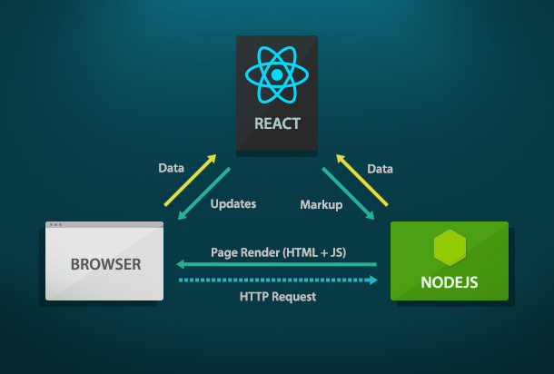
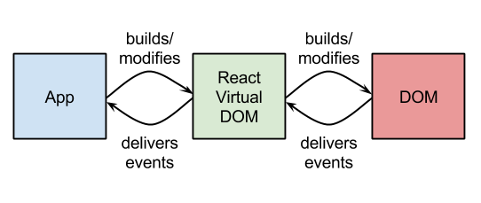

# React JS Two-Day

## Introduction to React JS

- React JS is a front-end framework, and is oftentimes referred to as simply a library.
- It was created and is still heavily maintained by Facebook.
- React helps you build front end systems that perform client-side rendering based on data that is received in JSON format from a back end.
- Here is a diagram about how this operates:



- The important takeaway is that React receives data from the backend system that is then integrated into the page view as a part of a "diff".
- It performs this via a concept that the team calls a "virtual DOM":



- Essentially React creates a JavaScript representation of the DOM and is then responsible for creating and updating the "real" DOM itself.
- This concept increases React's performance dramatically.

## Create React App

- Create React App is a tool developed by Facebook that gets you up and running with React quickly.
- Since React uses this virtual DOM concept and does not actually run HTML and JavaScript the standard way we are used to running them, advanced build processes are necessary.
- Create React App uses Webpack, which is a popular tool to automate build steps.
- Let's install the dependencies:
    - Install Node JS: https://nodejs.org/en
    - Install Create React App: `npm install create-react-app -g`
- We can now use CRA to implement a "hello world" application: `create-react-app hello_world`.
- It is also common to "eject", which simply means to extract all of the configuration files and place them into the project folder instead of solely taking the defaults: `npm run eject`.

## Create React App Folder Structure

- `config` - Webpack configuration files and environment data.
- `public` - Any public assets that are to be served as-is.
- `scripts` - Script files that are run by "scripts" in package.json to build, test, and start your application.
- `src` - This is where the main source code of the project will go.

## Introduction to Components

- Components in React can take two forms - functional and class-based components.
- Functional components are generally meant for display purposes only, whereas class-based components usually integrate functionality that can affect other components, pull data from APIs, etc.
- These two types are referred to as "dumb" and "smart" components respectively.
- Let's take a look at an example "dumb" component:

```javascript
import React from "react";

const HelloWorld = (props) => {
    return (
        <div>Hello World!</div>
    );
}

export default HelloWorld;
```

- And now the same component as a "smart" component:

```javascript
import React, { Component } from "react";

class HelloWorld extends Component {
    render() {
        return (
            <div>Hello World!</div>
        );
    }
}

export default HelloWorld;
```

- The main difference is that the smart components can take advantage of React's "lifecycle" methods to create more advanced functionality (more on this later).

## Mounting Components to the "Real" DOM

- All changes to the "DOM" happen to the virtual DOM, so what about what the client actually sees?
- React has a package called "ReactDOM" that handles placing injecting virtual DOM changes into the real DOM.
- This should generally happen in the entry point to your application:

```javascript
import React from "react";
import ReactDOM from "react-dom";

ReactDOM.render(<App />, document.getElementById("root"));
```

- This is the only time in a React application that you will see standard DOM manipulation.

## Component Lifecycle

- Each component goes through a lifecycle from initialization to rendering and beyond.
- Here is some additional information: https://reactjs.org/docs/react-component.html.
- The most commonly used methods are `componentWillMount`, `render`, and `componentDidMount`.
- As a reminder, these lifecycle methods can only be used in class-based components.
- Lifecycle methods are commonly used to perform setup and teardown operations within components.
- A popular example is fetching data via AJAX on `componentDidMount`.

## Props and Event Handling

- Each component can have "props" associated with it, which essentially look like HTML attributes.
- Props can pass data to components from data such as strings and objects, to functions.
- Let's see an example with a simple click event:

```javascript
import React, { Component } from "react";

class ClickExample extends Component {
    handleClick() {
        alert("Button Clicked!");
    }
    
    render() {
        return (
            <button onClick={this.handleClick.bind(this)}>Click Me</button>
        );
    }
}

export default ClickExample;
```

- Here the `.bind(this)` is used to maintain the class context when the event handler fires. This is very important in React.

## Component State

- Every class-based component maintains a "state", which controls how the virtual DOM, and thus the real DOM get updated.
- Every class-based component has a `state` property that is accessible throughout the entire class, including all lifecycle methods.
- Essentially, changes in state trigger a re-render of the component.
- State can also be initialized in the constructor of the component class.
- State is never mutated directly. Instead, a setter method called `.setState()` is used.
- Here is an example:

```javascript
import React, { Component } from "react";

class HelloWorld extends Component {
    constructor() {
        this.state = {
            greeting: "Hello World!"
        }
    }
    
    handleClick() {
        this.setState({
            greeting: "Goodbye World!"
        });
    }
    
    render() {
        return (
            <div>{this.state.greeting}</div>
            <div>
                <button onClick={this.handleClick.bind(this)}>Greet</button>
            </div>
        );
    }
}

export default HelloWorld;
```

- In this example, a click of the button will trigger a component refresh.

## Todo List Lab

- We will be building a todo list with React.
- The front end is already done for you here: https://github.com/arun-projects/Todo-List
- Use each of the concepts we learned to make your app work.
- **Bonus:** When each "done" button is clicked, create a strikethrough on the todo text.
- **Super Bonus:** Persist your data using localStorage.

## User Manager Code Along

- We will be working together on a user manager application.
- The front end is already done for you, and is located here: https://github.com/arun-projects/User-Manager.
- We will be using the "Person API" from MyAPI: https://myapi-profstream.herokuapp.com.
- We will create a new React application together using CRA.

## HTTP Requests with Axios

- Axios is a library that makes working with AJAX requests simple.
- It is promise-based, so we can use the traditional `.then()` `.catch()` model of native JavaScript promises.
- The documentation can be found here: https://github.com/axios/axios.
- To use the library we will be first importing it:

```javascript
import axios from "axios";

axios.request({
    url: "endpoint url here",
    method: "GET"
})
.then((response) => {
    console.log(response.data);
})
.catch((err) => {
    console.log(err);
});
```

## Forms in React

- Forms take two forms in React - "controlled" and "non controlled".
- Non controlled forms are those that are blank and accept new data to be submitted.
- Controlled forms rely on existing data to populate the form fields, and the user generally has the option to edit these data. An example is an edit form that is pre-populated with data from an existing object.
- Both types of forms require the component's state to be made aware of changes in the fields.
- This process mimics a two-way data binding system found in other popular frameworks.
- Let's see an example:

```javascript
import React, { Component } from "react";
import update from "immutability-helper";

class SampleForm extends Component {
    constructor() {
        this.state = {
            firstname: "",
            lastname: ""
        };
    }

    handleChange(event) {
        this.setState(update(this.state, {
            $merge: {
                [event.target.name]: event.target.value
            }
        }));
    }
    
    handleSubmit(event) {
        event.preventDefault();
        
        // Handle form submission here
    }
    
    render() {
        return (
            <form onSubmit={this.handleSubmit.bind(this)}>
                <div>
                    <input onChange={this.handleChange.bind(this)} name="firstname" type="text" />
                </div>
                <div>
                    <input onChange={this.handleChange.bind(this)} name="lastname" type="text" />
                </div>
                <div>
                    <button type="submit">Submit</button>
                </div>
            </form>
        );
    }
}

export default SampleForm;
```

## Wine List Lab Part 1

- In this lab we will be using React to send a GET request to pull a list of wines.
- We will be using the MyAPI "Wine API" to build our functionality.
- Set up a new React project and try to make a GET request to https://your-endpoint/wines.
- Use the front end provided to display the wine data on the page: https://github.com/arun-projects/Wine-Manager.
- Make a POST request to the same endpoint url with the data from the add wine modal window form to create a new wine.

## React Router V4

## Wine List Lab Part 2

- In this part we will use routing to add an edit wine page.
- Here are the steps you will need to follow:
	- Step 1: Create a route to `/wines/:id`.
	- Step 2: Use the route parameter to make a GET request to `http://your-endpoint/wines/:id`.
	- Step 3: Display wine data in the form on edit.html.
	- Step 4: On submit of the form create a PUT request to the same URL as above to update the wine record.